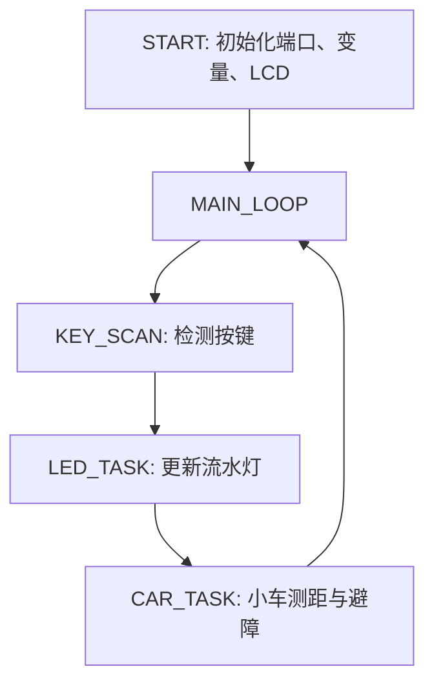
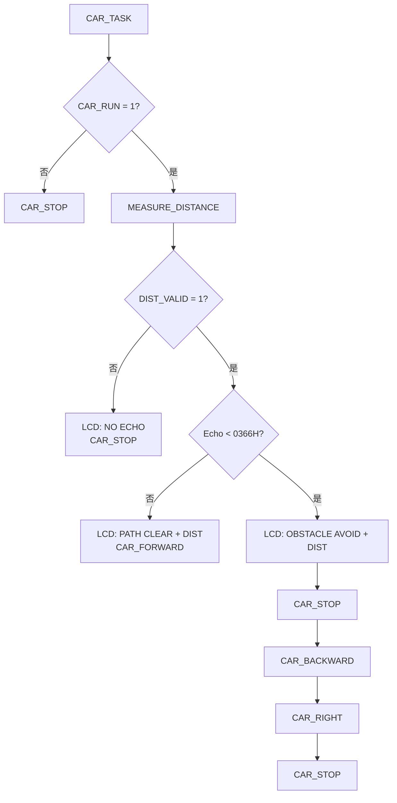

# 汇编程序清单与模块说明

课题 3 的控制程序采用 Keil A51 汇编语言编写，源文件为：

```text
firmware/asm/topic3_car.a51
```

构建命令为：

```powershell
.\firmware\build.ps1
```

构建输出为：

```text
build/topic3_car.hex
```

## 1 端口定义

| 端口 | 程序信号 | 外设 |
| --- | --- | --- |
| P1.0-P1.7 | LED0-LED7 | 8 位流水灯，低电平点亮 |
| P3.0 | `KEY_UP` | 上行流水灯按键 |
| P3.1 | `KEY_DOWN` | 下行流水灯按键 |
| P3.2 | `KEY_START` | 小车自动模式启动/停止 |
| P3.3 | `KEY_MODE` | 清扫/小车模式切换 |
| P3.4 | `US_TRIG` | HC-SR04 Trig |
| P3.5 | `US_ECHO` | HC-SR04 Echo |
| P2.0-P2.5 | 电机方向和使能 | L293D |
| P0.0 | `LCD_RS` | LCD1602 RS |
| P0.1 | `LCD_EN` | LCD1602 E |
| P0.2-P0.5 | LCD 数据位 | LCD1602 D4-D7 |

## 2 关键常量和变量

| 名称 | 地址/值 | 作用 |
| --- | --- | --- |
| `MODE` | 30H | 当前模式 |
| `LED_PAT` | 31H | LED 当前点亮码 |
| `CAR_RUN` | 32H | 小车运行标志 |
| `DIST_H/DIST_L` | 33H/34H | Echo 脉宽计数 |
| `DIST_VALID` | 35H | 测距有效标志 |
| `DIG_HUND/DIG_TENS/DIG_ONES` | 3AH-3CH | LCD 距离显示数字 |
| `MODE_LED_UP` | 00H | 上行流水灯模式 |
| `MODE_LED_DOWN` | 01H | 下行流水灯模式 |
| `MODE_CAR_AUTO` | 02H | 小车自动避障模式 |
| `MOTOR_FORWARD` | 35H | L293D 前进控制码 |
| `MOTOR_BACKWARD` | 3AH | L293D 后退控制码 |
| `MOTOR_RIGHT` | 39H | L293D 右转控制码 |
| `DANGER_H/DANGER_L` | 0366H | 15 cm 阈值对应 870 us |

## 3 程序模块

| 子程序 | 功能 |
| --- | --- |
| `START` | 初始化堆栈、端口、模式变量和 LCD |
| `MAIN_LOOP` | 主循环，依次调用按键、LED、小车任务 |
| `KEY_SCAN` | 检测 4 个按键，完成消抖和模式切换 |
| `LED_TASK` | 根据 `MODE` 移动 LED 点亮码 |
| `CAR_TASK` | 小车自动模式调度、测距、避障判断 |
| `MEASURE_DISTANCE` | 输出 Trig 脉冲并用 Timer0 测 Echo 高电平 |
| `DIST_LT_DANGER` | 比较 Echo 计数是否小于 15 cm 阈值 |
| `ECHO_TO_DIGITS` | 将 Echo 脉宽换算成 3 位十进制厘米值 |
| `LCD_PRINT_DISTANCE` | 在 LCD 第二行显示 `DIST:xxxcm` |
| `CAR_STOP` | 关闭电机输出 |
| `CAR_FORWARD` | 输出前进控制码 |
| `CAR_BACKWARD` | 输出后退控制码 |
| `CAR_RIGHT` | 输出右转控制码 |
| `LCD_INIT` | LCD1602 4 位初始化 |
| `LCD_CMD/LCD_DATA` | 写 LCD 指令/数据 |
| `DELAY_*` | 消抖、显示和动作延时 |

## 4 主流程



## 5 避障流程



## 6 关键程序片段

入口和主循环：

```asm
START:
            MOV SP,#60H
            MOV P0,#0FFH
            MOV P1,#0FFH
            MOV P2,#MOTOR_STOP
            MOV P3,#0FFH
            CLR US_TRIG

            MOV MODE,#MODE_LED_UP
            MOV LED_PAT,#01H
            MOV CAR_RUN,#00H
            MOV DIST_VALID,#00H

            ACALL LCD_INIT
            MOV DPTR,#MSG_READY
            ACALL LCD_PRINT_LINE1
            MOV DPTR,#MSG_LED_UP
            ACALL LCD_PRINT_LINE2

MAIN_LOOP:
            ACALL KEY_SCAN
            ACALL LED_TASK
            ACALL CAR_TASK
            SJMP MAIN_LOOP
```

危险距离阈值：

```asm
DANGER_H        EQU 03H      ; 15 cm * 58 us = 870 us = 0366H
DANGER_L        EQU 66H
```

电机控制码：

```asm
MOTOR_STOP      EQU 00H
MOTOR_FORWARD   EQU 35H
MOTOR_BACKWARD  EQU 3AH
MOTOR_LEFT      EQU 36H
MOTOR_RIGHT     EQU 39H
```

完整程序清单以 `firmware/asm/topic3_car.a51` 为准，提交时可将该文件作为程序附件，并在说明书附录中摘录上述关键模块。
