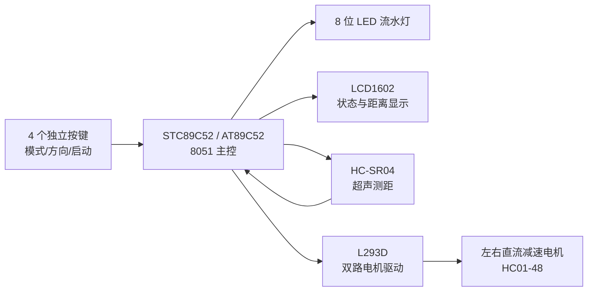
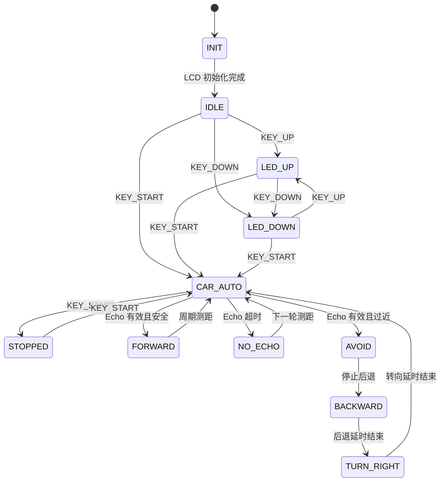

# 课题 3 项目设计文档

## 1 项目目标

本项目实现“流水灯及智能小车超声测距及避障”。系统以 STC89C52/8051 兼容单片机为核心，使用汇编语言编写控制程序，在 Proteus 中完成仿真验证，并为后续实物小车调试提供可复用的端口定义、程序结构和测试流程。

第一版实现目标：

1. 8 个 LED 在按键控制下实现上行和下行流水。
2. LCD1602 显示当前运行状态。
3. L293D 控制左右两个直流电机，实现前进、后退、转向和停止。
4. HC-SR04 通过 Trig/Echo 进行测距，Echo 脉宽低于 15 cm 阈值时触发避障。
5. 汇编程序可由 Keil A51 生成 HEX，并加载到 Proteus 8051 模型中。

## 2 硬件结构

### 2.0 系统框图



### 2.1 核心器件

| 模块 | 器件 | 作用 |
| --- | --- | --- |
| 主控 | STC89C52 或 AT89C52 仿真等效模型 | I/O 控制、定时测距、状态机调度 |
| 显示 | LCD1602/HD44780U | 显示 LED 模式、小车状态和避障提示 |
| 测距 | HC-SR04 | 输出与距离成比例的 Echo 脉宽 |
| 驱动 | L293D | 驱动左右直流电机正反转 |
| 输出 | 8 个 LED | 展示流水灯功能 |
| 输入 | 4 个独立按键 | 切换流水方向、小车启动和模式 |

### 2.1.1 物料清单

| 序号 | 器件/材料 | 数量 | 关键参数或说明 | 是否必需 |
| --- | --- | ---: | --- | --- |
| 1 | STC89C52 单片机 | 1 | 8051 兼容核心，12 MHz 晶振 | 必需 |
| 2 | LCD1602/LM016L | 1 | HD44780 兼容，4 位数据总线 | 必需 |
| 3 | HC-SR04 超声波模块 | 1 | Trig/Echo 接口，约 2-400 cm | 必需 |
| 4 | L293D 电机驱动 | 1 | 双 H 桥，逻辑电源 5 V，电机电源独立 | 必需 |
| 5 | HC01-48 直流减速电机 | 2 | 3-6 V 参考工作电压，减速比 1:48 | 必需 |
| 6 | LED | 8 | 建议串联 220 ohm 至 1 kohm 限流电阻 | 必需 |
| 7 | 独立按键 | 4 | 低电平有效，需上拉 | 必需 |
| 8 | 晶振 | 1 | 12 MHz，用于测距计时换算 | 必需 |
| 9 | 电容 | 若干 | 晶振电容约 30 pF，复位电容约 10 uF，电源去耦 0.1 uF | 必需 |
| 10 | 电阻 | 若干 | 按键上拉、LED 限流、复位电阻 | 必需 |
| 11 | 74HC573 | 1 | 可选 I/O 扩展或并行锁存 | 可选 |
| 12 | DS1302 | 1 | 可选运行计时或定时功能 | 可选 |
| 13 | PCF8591 | 1 | 可选模拟量采集扩展 | 可选 |

### 2.2 端口分配

| 单片机端口 | 信号 | 说明 |
| --- | --- | --- |
| P1.0-P1.7 | LED0-LED7 | 低电平点亮 |
| P3.0 | KEY_UP | 上行流水灯，低电平有效 |
| P3.1 | KEY_DOWN | 下行流水灯，低电平有效 |
| P3.2 | KEY_START | 小车启动/停止，低电平有效 |
| P3.3 | KEY_MODE | 清扫/小车模式，低电平有效 |
| P3.4 | US_TRIG | HC-SR04 触发脉冲输出 |
| P3.5 | US_ECHO | HC-SR04 回波脉冲输入 |
| P2.0/P2.1 | 左电机 IN1/IN2 | L293D 左电机方向 |
| P2.2/P2.3 | 右电机 IN3/IN4 | L293D 右电机方向 |
| P2.4/P2.5 | ENA/ENB | L293D 左右使能 |
| P0.0 | LCD_RS | LCD 寄存器选择 |
| P0.1 | LCD_EN | LCD 使能 |
| P0.2-P0.5 | LCD_D4-D7 | LCD 4 位数据线 |

## 3 软件结构

汇编源文件为 `firmware/asm/topic3_car.a51`，采用单文件分模块组织。后续若程序继续增大，可拆成多个 `.a51` 模块。

| 子程序 | 责任 |
| --- | --- |
| `START` | 初始化堆栈、端口、变量和 LCD |
| `KEY_SCAN` | 检测 4 个按键并切换模式 |
| `LED_TASK` | 根据模式更新 P1 流水灯 |
| `CAR_TASK` | 小车运行状态机和避障调度 |
| `MEASURE_DISTANCE` | 输出 Trig，使用 Timer0 记录 Echo 脉宽 |
| `DIST_LT_DANGER` | 比较 Echo 计数是否低于 15 cm 阈值 |
| `ECHO_TO_DIGITS` | 将 Echo 脉宽按 `cm = us / 58` 转换为 3 位十进制距离 |
| `LCD_PRINT_DISTANCE` | 在 LCD 第二行显示 `DIST:xxxcm` |
| `CAR_FORWARD` 等 | 输出 L293D 电机控制码 |
| `LCD_INIT`/`LCD_CMD`/`LCD_DATA` | LCD1602 4 位写入 |
| `DELAY_*` | 软件延时 |

## 4 状态机设计

系统主循环执行：

```text
KEY_SCAN -> LED_TASK -> CAR_TASK -> MAIN_LOOP
```

状态转换如下：



### 4.1 LED 模式

`KEY_UP` 将 `MODE` 设置为 `MODE_LED_UP`，停止小车，LED 从 P1.0 向 P1.7 流动。`KEY_DOWN` 将 `MODE` 设置为 `MODE_LED_DOWN`，停止小车，LED 从 P1.7 向 P1.0 流动。

### 4.2 小车自动模式

`KEY_START` 将系统切换到 `MODE_CAR_AUTO`，并在启动和停止之间切换。启动后程序周期性触发 HC-SR04 测距。若测距无效，小车停止并显示 `NO ECHO`。若测距有效且大于危险阈值，小车前进，LCD 第一行显示 `PATH CLEAR`，第二行显示 `DIST:xxxcm`。若测距有效且低于危险阈值，小车停止，LCD 第一行显示 `OBSTACLE AVOID`，第二行显示当前距离，随后执行后退、右转、停止。

### 4.3 避障阈值

HC-SR04 常用换算关系为：

```text
距离(cm) = Echo 高电平时间(us) / 58
```

第一版程序设置危险距离为 15 cm：

```text
15 cm * 58 us/cm = 870 us = 0366H
```

当 Timer0 记录的 Echo 高电平计数低于 `0366H` 时，判定障碍物过近。

## 5 构建与仿真

### 5.1 构建

在仓库根目录执行：

```powershell
.\firmware\build.ps1
```

构建脚本依次调用：

```text
C:\Keil_v5\C51\BIN\A51.EXE
C:\Keil_v5\C51\BIN\BL51.EXE
C:\Keil_v5\C51\BIN\OH51.EXE
```

当前构建已验证通过，程序代码大小约 891 字节，输出文件为：

```text
build/topic3_car.hex
```

### 5.2 Proteus 仿真

Proteus 安装位置：

```text
C:\Program Files (x86)\Labcenter Electronics\Proteus 8 Professional\BIN\PDS.EXE
```

仿真项目建议保存为：

```text
proteus/topic3_car.pdsprj
```

在 Proteus 中放置 AT89C52 或兼容 8051 模型，按端口分配表连接 LED、按键、LCD1602、L293D、直流电机和 HC-SR04。如果 Proteus 当前库中没有 HC-SR04 模型，可先用脉冲源模拟 Echo 输入，验证 P3.5 脉宽对避障动作的影响。最终元件清单以 `proteus/topic3_bom.csv` 为准，GUI 搭建顺序以 `proteus/topic3_gui_build_steps.md` 为准，接线以 `proteus/topic3_car_wiring.csv` 为准，Echo 脉冲测试参数以 `proteus/topic3_echo_test_inputs.csv` 为准。

### 5.3 本地 starter 工程

已新增 `tools/create_proteus_starters.ps1`，可从 Proteus 自带 8051 LCD1602 和 DC motor 样例生成两个本地 starter 工程，并将固件附件替换为本项目的 `build/topic3_car.hex`。这两个工程用于确认 Proteus 能打开 8051 项目并加载本项目 HEX，不作为最终课题 3 原理图提交。由于 starter 派生自 Labcenter 示例内容，已在 `.gitignore` 中忽略。

已新增 `tools/launch_proteus.ps1`，用于在项目文件存在时打开 Proteus 工程。命令行探查 `PDS.EXE /?`、`PROSPICE.EXE /?` 未发现可稳定自动生成 ISIS 原理图的接口，因此最终 `topic3_car.pdsprj` 仍按检查表在 Proteus GUI 中搭建。调查记录见 `docs/proteus自动生成可行性调查.md`。

验证命令如下：

```powershell
.\firmware\build.ps1
.\tools\create_proteus_starters.ps1
.\tools\check_proteus_starters.ps1
.\tools\check_topic3_proteus_plan.ps1
```

已验证输出包括：

```text
Created D:\C51BigHomeWork\proteus\topic3_lcd1602_starter.pdsprj
Created D:\C51BigHomeWork\proteus\topic3_dc_motor_starter.pdsprj
Verified proteus\topic3_lcd1602_starter.pdsprj
Verified proteus\topic3_dc_motor_starter.pdsprj
```

最终完整仿真工程仍应按 `proteus/FINAL_CIRCUIT_CHECKLIST.md` 和 `proteus/topic3_car_wiring.csv` 从零搭建，并保存为 `proteus/topic3_car.pdsprj`。

### 5.4 仿真测试矩阵

| 测试项 | 操作 | 预期现象 | 记录位置 |
| --- | --- | --- | --- |
| 上行流水灯 | 按下 `KEY_UP` | P1 输出从低位到高位移动的低电平点亮码，LCD 显示 `LED UP` | `docs/仿真测试记录.md` |
| 下行流水灯 | 按下 `KEY_DOWN` | P1 输出从高位到低位移动的低电平点亮码，LCD 显示 `LED DOWN` | `docs/仿真测试记录.md` |
| 小车启动 | 按下 `KEY_START` | 模式进入自动小车，P2 方向端准备输出 | `docs/仿真测试记录.md` |
| 无回波 | Echo 保持低电平 | LCD 第二行显示 `NO ECHO`，P2 输出停止码 | `docs/仿真测试记录.md` |
| 安全距离 | 输入宽于 870 us 的 Echo 脉冲 | LCD 显示 `DIST:xxxcm`，P2 输出前进码 `35H` | `docs/仿真测试记录.md` |
| 危险距离 | 输入短于 870 us 的 Echo 脉冲 | LCD 显示障碍提示，小车停止、后退、右转、停止 | `docs/仿真测试记录.md` |

## 6 当前进度

| 项目 | 状态 |
| --- | --- |
| 核心 datasheet 保存 | 已完成 |
| 关键参数索引 | 已完成 |
| 汇编源文件 | 已完成第一版 |
| Keil A51 构建 | 已通过，0 错误 0 警告 |
| HEX 输出 | 已生成 |
| Proteus 连接说明 | 已完成 |
| Proteus starter 工程 | 可本地生成并已校验 |
| Proteus BOM 与 GUI 搭建工单 | 已完成并可脚本校验 |
| Proteus 精确接线表与 Echo 测试表 | 已完成并可脚本校验 |
| Proteus 自动生成可行性调查 | 已完成 |
| Proteus 原理图文件 | 待创建 |
| 实物调试记录 | 待补充 |

## 7 下一步

1. 运行 `.\tools\check_topic3_proteus_plan.ps1`，确认 BOM、GUI 搭建工单、接线表和 Echo 测试表完整。
2. 运行 `.\tools\start_final_proteus_session.ps1 -OpenReferences`，打开 Proteus 和参考资料。
3. 在 Proteus 中创建 `topic3_car.pdsprj`，按 `proteus/topic3_gui_build_steps.md` 和 `proteus/topic3_car_wiring.csv` 完成接线。
4. 加载 `build/topic3_car.hex`，先测试 LED 和 LCD。
5. 再测试 P2 输出与 L293D 电机动作。
6. 最后用 HC-SR04 模型或脉冲源测试 Echo 阈值避障。
7. 将仿真截图和测试结果补入课程设计说明书，并运行 `.\tools\check_final_submission.ps1`。
